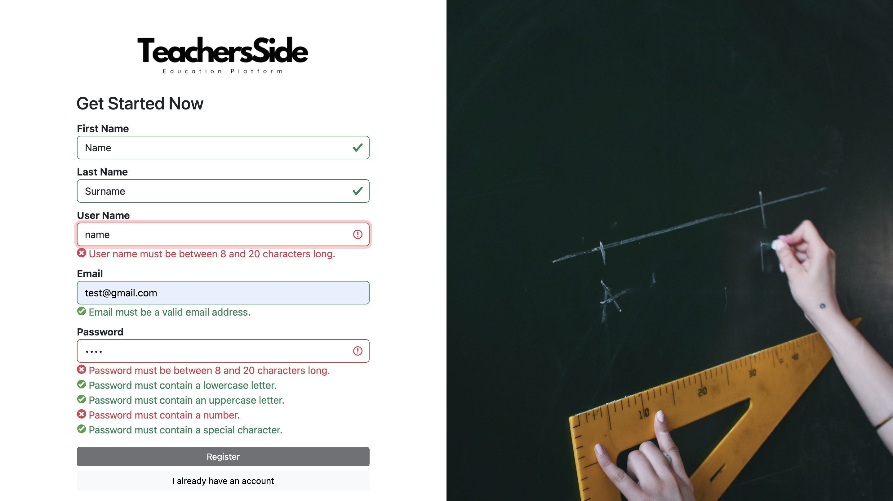

# Teachers Side

A web application designed for primary and high school teachers to post questions and answers, exchange resources, and stay updated about upcoming conferences and activities.

## Features

### User Authentication

The application features user authentication & authorization. Users can create accounts which are then linked to the resources they create enabling them to manage their resources.

### Resource Sharing

The materials tab allows users to access resources uploaded by other users. They can also upload their own and then edit or remove them.

### Q&A Forum

The forum tab features forums for each subject, where teachers can post topics or questions regarding that subject.

### Upcoming Events

The event tab lets the teachers view events such as teaching conferences & seminars, including the event details. They also can create events themselves to inform other techers of such events.

## Tech Stack

The backend API is made in .NET and a PostgreSQL database is generated according to the models using .NET Identity & Entity Framework. The frontend is made using Angular and TypeScript. For styling we use some MaterialUI components & bootstrap classes. The user authorization is done using JWT which are generated on login for authenticated users and stored in the browser's local storage.

## Run Locally

### Backend

You need to have .NET 6 installed on your machine to be able to run the backend API.

To run the backend locally you first need to create a local database. To do this, you can create a docker container and create a database in it by running the following command in your terminal:

`docker run --name local-psql-teachers-side -v local_psql_data:/var/lib/postgresql/data -p 54322:5432 -e POSTGRES_PASSWORD=my_password -d postgres` - Replace with your own password, port etc.

Then in the .NET project change the DB settings to the ones you set using the command.

You can now create a migration and your database by running:

`dotnet ef migrations add MigrationName`

`dotnet ef database update`

Now you are ready to build and run the project. The API will be listening on `https://localhost:7067`.

### Frontend

You will need to install Node.js and its associated package manager, npm.

Navigate to the folder `src/frontend/teachers-side` and open your terminal, then run the following commands:

`npm install` - This installs the required dependencies.

`npm run start` - This executes the `ng serve` script starting the Angular application.

You will then be able to open your browser of choice on `http://localhost:4200/` and view the application.

## Team

Mentors
- Boban Joksimoski
- Ivan Chorbev

Students
- Jana Ristovska 203186
- Anastasija Spasovska 203050
- Ekaterina Sazdova 201063
